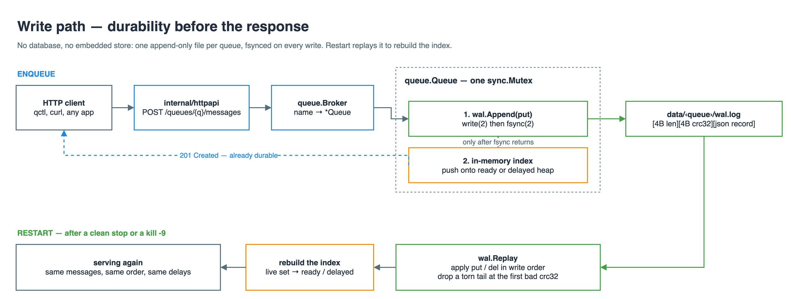
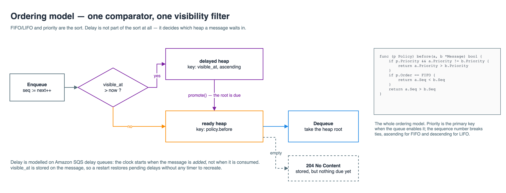

# Walkthrough

A guided read of this repository, in the order the code makes sense to read it. It exists
for two reasons: so a reviewer can follow the reasoning without reverse-engineering it from
the source, and so I can explain any line of it out loud.

Every section answers the same three questions. What does this file do? Why is it built this
way and not another way? What would break if it were not?

---

## 0. The sixty-second version

The assessment asks for a queue that can be FIFO or LIFO, with priority, with delay, in any
combination, persisted without a database, safe under concurrency.

Two ideas carry the whole implementation.

**Ordering is one comparison function.** Priority is the primary sort key, the sequence
number breaks ties ascending or descending, and that is the entire difference between a
priority FIFO and a priority LIFO. Delay is not part of the sort at all: it decides whether
a message is eligible yet, which is a second heap and a promotion step.

**Durability is one append-only file per queue.** Every write is framed, checksummed, and
fsynced before the caller hears back. Startup replays the file to rebuild memory. Memory is
a cache of the file, never the other way round.

Everything else is plumbing around those two.

---

## 1. Deciding what to build

Before any code, every candidate feature went through the same three questions:

- **A.** Is it named in the assessment? Then build it.
- **B.** Is it unnamed, but required for something the assessment *does* name to actually
  hold? Then build it.
- **C.** Is it only "a real queue would obviously have this"? Then do not build it. Write
  about it instead.

C is the one that matters, because the assessment has a section called *Additional
questions* that asks, among other things, what I would add given more time. That section is
where ambition belongs. Every feature added to the code is a feature subtracted from that
answer.

Worked examples:

| Feature | Test | Outcome |
|---|---|---|
| FIFO/LIFO, priority, delay | named | built |
| Persistence without a database | named | built |
| Log compaction | **B** — the assessment names "protected from application restarts", and startup replays the whole log, so an ever-growing log makes recovery time grow without bound | built |
| Queue name validation | **B** — the name becomes a directory, so without it a name like `../..` escapes the data directory | built |
| Ack / visibility timeout | **C** — durability of *stored* data holds without it | answered, not built |
| Dead-letter queues, auth, clustering, long polling | **C** | answered, not built |

A useful detail: the assessment links to
[Amazon SQS delay queues](https://docs.aws.amazon.com/AWSSimpleQueueService/latest/SQSDeveloperGuide/sqs-delay-queues.html),
and that page spends a paragraph distinguishing a delay queue (hidden when a message is
*added*) from a visibility timeout (hidden after it is *consumed*). The linked reference
tells you which of the two is in scope.

---

## 2. `internal/wal` — the storage engine

Read [internal/wal/wal.go](internal/wal/wal.go) first. Everything else depends on it, and it
is the requirement with the least room to improvise: *storage cannot be delegated to a
separate queue or database*. No SQLite, no BoltDB, no Redis. The file format is mine to
design.


<sub>The two paths this section covers: an enqueue reaching disk, and a restart rebuilding
memory from it. Source: [docs/diagrams/write-path.drawio](docs/diagrams/write-path.drawio)</sub>

### The record format

```
[4B length, big endian][4B CRC32 of payload][payload]
```

Two fields, and each is load-bearing.

**Length** is how you find record boundaries. A log is a stream of bytes; without a length
prefix there is no way to know where one record stops and the next begins. (A delimiter
would work too, but then the payload has to be escaped, and JSON payloads contain newlines.)

**CRC32** is how you tell a complete record from a half-written one. This is the subtle
part. Say the process is killed in the middle of `write(2)`. The file now ends with some
prefix of a record. On the next startup the length prefix says "160 bytes follow" and only
90 arrived. Without the checksum, a record that happens to be the right length but wrong
content would be parsed as valid and quietly corrupt the queue.

### Why fsync

`Append` at [wal.go:128](internal/wal/wal.go#L128) does `Write` and then `Sync`.

`write(2)` does not put bytes on a disk. It copies them into the kernel's page cache and
returns. The kernel flushes them later, on its own schedule. If the machine loses power in
between, those bytes are gone even though `write` returned success. `fsync(2)` is the call
that blocks until the device confirms the data is durable.

That single line is the difference between "the queue usually keeps your messages" and "the
queue keeps your messages". It is also the throughput ceiling of the whole system, since an
fsync is milliseconds where everything else is nanoseconds. Both facts are stated in the
README rather than hidden.

The same reasoning applies to `syncDir` at [wal.go:222](internal/wal/wal.go#L222). Creating
a file and fsyncing its *contents* still leaves the directory entry unflushed, so a crash
could leave a durable file that nothing points to. Fsyncing the directory commits the name.

### Recovery, and the torn tail

`Replay` at [wal.go:78](internal/wal/wal.go#L78) walks the log from byte zero, hands each
intact record to a callback, and stops at the first one that does not check out. It then
truncates the file at that point.

Truncating sounds destructive. It is correct, and the argument is worth being able to give:

> A bad record can only ever be the last one. Any earlier record already returned from
> `fsync`, which means the bytes were confirmed durable before the process moved on. So
> anything after the last good record is a write that was in flight when the process died,
> and by definition no client was ever told it succeeded.

`TestReplayDiscardsTornTail` in [internal/wal/wal_test.go](internal/wal/wal_test.go) forges
exactly that situation: three good records, then a header claiming 64 bytes with only 4
following. Replay returns three records, the file shrinks back to the last good boundary,
and appending afterwards still works.

### Compaction

`Rewrite` at [wal.go:158](internal/wal/wal.go#L158) replaces the log with a fresh copy of
only the live records.

Why it is needed: a queue deletes every message it delivers. Send a million and consume a
million, and the log holds two million records describing zero messages. Since startup
replays the whole log, restart time grows forever even though the queue is empty.

Why it is safe: the new log is written to `wal.log.compact`, fsynced, and then moved with
`rename(2)`, which POSIX guarantees is atomic. A crash at any instant leaves either the
complete old log or the complete new one. There is no moment where a reader could see a
half-swapped file.

---

## 3. `internal/queue/policy.go` — the ordering model

Sixty-six lines, and the interesting part is one function.
[policy.go:58](internal/queue/policy.go#L58):

```go
func (p Policy) before(a, b *Message) bool {
	if p.Priority && a.Priority != b.Priority {
		return a.Priority > b.Priority
	}
	if p.Order == FIFO {
		return a.Seq < b.Seq
	}
	return a.Seq > b.Seq
}
```

The assessment says "we can have a delay, priority LIFO queue, or a priority FIFO". Read
that carefully and it is describing *configurations of one thing*, not several things. So
the code has one comparator and a struct of settings, and each phrase in the assessment maps
to a literal value:

```go
{Order: LIFO, Priority: true, DelaySeconds: 30}  // "a delay, priority LIFO queue"
{Order: FIFO, Priority: true}                    // "a priority FIFO"
```

Two decisions inside this small function are worth defending.

**Why the sequence number rather than a timestamp.** Two messages enqueued in the same
microsecond can carry the same timestamp, which makes FIFO ambiguous exactly when it is
under load and matters most. `Seq` is a counter incremented under the queue's lock, so it
is unique and total by construction. It is also what makes ordering survive a restart:
timestamps would need clock assumptions, whereas the sequence is written into the log.

**Why `Priority` is a flag rather than always-on.** Mechanically, "priority disabled" and
"every message has priority 0" behave identically, so this could have been dropped. It is
kept because the assessment's own vocabulary distinguishes "a priority FIFO" from a FIFO,
and because it makes a surprise impossible: on a queue created without priority, a client
that sends `priority: 9` cannot silently jump the line. `Enqueue` zeroes the field.

---

## 4. `internal/queue/queue.go` — the engine

[internal/queue/queue.go](internal/queue/queue.go) is where storage and ordering meet.


<sub>The engine in one picture: a gate that sorts messages into two heaps, and a comparator
that decides the root of one of them. Source:
[docs/diagrams/ordering-model.drawio](docs/diagrams/ordering-model.drawio)</sub>

### Two heaps

A heap is a tree kept in an array where the smallest element by some comparison is always at
the root. Push and pop cost O(log n); finding the next message costs O(1). The relevant
property here is that the comparison is a parameter, so `msgHeap` at
[queue.go:280](internal/queue/queue.go#L280) takes it as a field and one type serves both
heaps:

- `ready` compares with `policy.before` — the message that should go next is at the root.
- `delayed` compares with `visible_at` ascending — the message that becomes visible soonest
  is at the root.

`promote` at [queue.go:242](internal/queue/queue.go#L242) is the whole delay mechanism:

```go
for q.delayed.Len() > 0 && !q.delayed.items[0].VisibleAt.After(now) {
	heap.Push(q.ready, heap.Pop(q.delayed).(*Message))
}
```

Because the delayed heap is sorted by visibility, the messages that are due are always a
prefix of it. The loop touches only the ones it actually moves and stops at the first one
that is not due. There is no scan of pending messages and no timer goroutine, which is why
a restart restores pending delays for free: `visible_at` is a stored timestamp, and after
recovery `push` files each message into whichever heap matches the current clock.

### Write-ahead, in both directions

The ordering of these two steps is the durability argument, so it is worth stating both
cases.

`Enqueue` at [queue.go:136](internal/queue/queue.go#L136) appends the `put` record, and only
then pushes onto a heap. Crash in between and the message is in the log but not in memory —
the next startup replays it and it appears. Nothing is lost.

`Dequeue` at [queue.go:184](internal/queue/queue.go#L184) appends the `del` record, and only
then pops from the heap. Crash in between and the message is tombstoned on disk but still in
memory — memory dies with the process, so the next startup agrees it is gone. Nothing is
delivered twice.

If the order were reversed in either case, the crash window would produce the opposite and
worse outcome: an acknowledged message that vanishes, or a delivered message that comes back.

This ordering is also where the at-most-once semantics come from, and it is the honest
answer to the "replay messages" question. The `del` is durable before the message is handed
to the consumer, so a consumer that crashes after receiving loses that message. That is a
choice, and the README describes the lease record that would change it.

### The mutex

One `sync.Mutex` per queue, covering both the log and the heaps
([queue.go:64](internal/queue/queue.go#L64)).

Why not `RWMutex`: it only helps when there are readers that do not write, and here both
`Enqueue` and `Dequeue` write to both structures. There are no pure readers to admit in
parallel.

Why one lock over both rather than one each: because the two must move together. If the log
and the index had separate locks, another goroutine could observe an index that does not
match the log. Holding a single lock across the append and the memory update makes the pair
atomic to everyone outside.

Why this is enough for "must support concurrency": correctness under concurrency means every
message goes to exactly one consumer, and the lock gives that directly. `TestConcurrentConsumersNeverDuplicate` runs eight consumers against five hundred messages under `-race` and
asserts every sequence number was seen exactly once.

What it costs: an fsync happens inside the lock, so one queue serialises at the disk's sync
rate. Different queues have different locks and do not contend. The fix is group commit,
which is item two in the "more time" list.

### `maybeCompact`

At [queue.go:250](internal/queue/queue.go#L250). Fires when the log holds at least 1024
records and fewer than half of them are live. Both conditions matter: the size floor stops a
tiny log from being rewritten constantly, and the ratio keeps the amortised cost of a rewrite
proportional to the garbage it reclaims.

`TestCompactionShrinksLog` sends 600 and consumes 424, which is exactly the point where 1024
records describe 176 live messages, then reopens the queue and checks the survivors are the
right ones in the right order. Compaction that loses data is worse than no compaction, so the
test verifies the contents, not just the size.

---

## 5. `internal/queue/broker.go` — many queues

[internal/queue/broker.go](internal/queue/broker.go) maps names to queues and owns the data
directory. Three details are worth pointing at.

**Name validation** ([broker.go:14](internal/queue/broker.go#L14)). A queue name becomes a
directory name, so `nameRE` restricts it to letters, digits, underscore and hyphen. This is
allow-listing rather than escaping: a name like `../../etc` never gets far enough to need
sanitising.

**Atomic policy writes** (`writeMeta`, [broker.go:168](internal/queue/broker.go#L168)). The
policy is written to a temporary file, fsynced, then renamed into place, the same pattern as
compaction. Writing `meta.json` in place would leave a window where a crash produces a
truncated file, and a queue whose policy cannot be read is a queue whose messages cannot be
ordered.

**Lock scope** ([broker.go:29](internal/queue/broker.go#L29)). The broker's `RWMutex` guards
only the map. Once a caller holds a `*Queue` it works against that queue's own mutex, so
traffic on separate queues is genuinely parallel. `List` copies the queue pointers out under
the read lock and then collects stats outside it, so a slow queue cannot block queue
creation.

---

## 6. `internal/httpapi` — the thin part

[internal/httpapi/server.go](internal/httpapi/server.go) decodes JSON, calls one queue
method, encodes the result. It is deliberately boring: everything that could be subtly wrong
lives in `internal/queue`, and this layer has no state of its own.

Worth noting:

**No router dependency.** Go's `net/http.ServeMux` has matched on method and path variables
since 1.22, so `POST /queues/{name}/messages` is a standard-library pattern. The project has
zero third-party dependencies, which is a much easier claim to make when the storage layer is
also hand-written.

**204 versus 404 on pop** ([server.go:121](internal/httpapi/server.go#L121)). `404` means the
queue does not exist. `204` means the queue exists and has nothing deliverable *right now* —
which is not the same as empty, because it may be holding messages that are still inside
their delay. Collapsing the two would make a delay queue indistinguishable from a missing one.

**`DelaySeconds` is a pointer** ([server.go:92](internal/httpapi/server.go#L92)). A message
may override the queue's default delay, including overriding it to zero. With a plain `int`,
"not specified" and "specified as 0" are both the zero value and cannot be told apart. The
pointer keeps absence distinct from zero. This mirrors SQS message timers, where a per-message
`DelaySeconds` takes precedence over the queue's.

**Bounded bodies.** `http.MaxBytesReader` caps a request at 1 MiB so one client cannot make
the server allocate without limit.

---

## 7. `cmd/` — the binaries

**`cmd/queued`** is the server. The only part worth reading is that opening the broker
replays every queue's log *before* the listener starts, so the server is never reachable in a
half-recovered state. Shutdown has nothing to flush, because every accepted message was
already fsynced.

**`cmd/qctl`** is the "simple application that can use and interact with the queue" the
assessment asks for. It talks over the same HTTP API any other client would use and imports
nothing from `internal/`. `qctl worker -n 4` runs four concurrent consumers and reports
`total / unique / duplicates`, which turns the concurrency requirement into a number you can
look at.

One small thing in there is worth knowing, because it is a common Go trap. The `flag` package
stops parsing at the first non-flag argument, so `qctl create orders -order lifo` would leave
the flags unread and silently use defaults. `takeArgs` peels off the fixed number of
positional arguments first and parses the rest, which also means a message body that starts
with a dash is not mistaken for a flag.

---

## 8. What the tests are for

Tests here are evidence for specific claims in the README, not coverage for its own sake.

| Claim | Test |
|---|---|
| "a torn write cannot corrupt the log" | `TestReplayDiscardsTornTail` |
| "corruption is not returned as valid data" | `TestReplayStopsAtBadChecksum` |
| "compaction preserves the live set" | `TestCompactionShrinksLog` |
| "all four policy combinations work" | `TestPolicyOrdering` |
| "delay hides from enqueue, not from consume" | `TestDelayHidesMessageUntilVisible` |
| "a pending delay survives a restart" | `TestDelayedMessageSurvivesRestart` |
| "restart recovers exactly the undelivered messages" | `TestStateSurvivesRestart` |
| "no message goes to two consumers" | `TestConcurrentConsumersNeverDuplicate` |
| "nothing is lost under mixed load" | `TestConcurrentProducersAndConsumers` |

`-race` matters for the last two. Go's race detector instruments memory access and reports
unsynchronised reads and writes, so it catches a missing lock even on a run where the timing
happened to work out. A concurrency test that passes without it proves much less.

`scripts/demo.sh` covers what a unit test cannot: it `kill -9`s a live server and restarts
it. No deferred cleanup, no flush on the way out, nothing but what was already on disk.

---

## 9. Questions I would expect, and the answers

**Why not just use SQLite or BoltDB?** The assessment forbids delegating storage to a
separate database. Beyond that: a queue's access pattern is append and scan, which is what a
log is for. A B-tree would buy random access the queue never uses, and cost a page cache and
a more complex crash story.

**Is one fsync per message not slow?** Yes, and that is the intended trade. A queue that
returns 201 before the data is durable is fast at the wrong thing. The right fix is group
commit — batch concurrent writers into one fsync — which keeps the guarantee and amortises
the cost. It is listed as future work rather than half-built.

**Why is the whole index in memory?** Because recovery replays the whole log anyway, so the
live set has to be materialisable. It bounds capacity to memory, which is a real limit worth
stating: roughly a few hundred bytes per pending message. Segmented logs plus keeping only
the ready set resident is the direction if that limit ever binds.

**What happens if two servers point at the same data directory?** They corrupt each other.
There is no file lock. A single-writer assumption is stated rather than enforced; a `flock`
on the data directory at startup is a few lines and would be the first thing to add if this
were deployed anywhere real.

**Why is priority an `int` and not a bounded range?** Nothing in the comparator needs a
bound, and picking one (SQS-style 0–9, RabbitMQ's 0–255) would be an arbitrary limit the
assessment did not ask for.

**How would you know it is behaving in production?** Currently you would not, beyond
`GET /queues`. Depth, age of the oldest ready message, and fsync latency are the three
numbers I would export first, and they are on the "more time" list for that reason.
